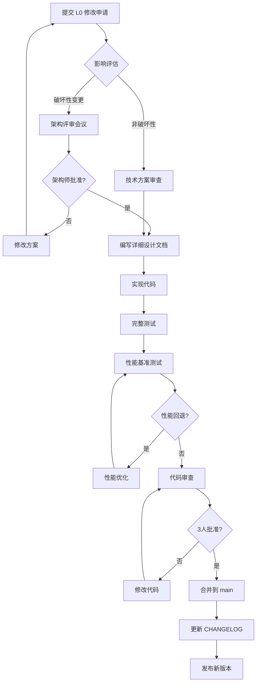

# SuperVM 内核定义与开发规范

> **文档版本**: v1.0  
> **最后更新**: 2025-11-05  
> **维护者**: KING XU (CHINA)

---

## 📚 目录

- [1. 内核定义](#1-内核定义)
- [2. 分级保护机制](#2-分级保护机制)
- [3. 开发规范](#3-开发规范)
- [4. 修改审批流程](#4-修改审批流程)
- [5. 测试要求](#5-测试要求)
- [6. 性能基准](#6-性能基准)

---

## 1. 内核定义

### 1.1 什么是 SuperVM 内核？

**SuperVM 内核** = Phase 2 (WASM Runtime) + Phase 4 (并行调度)

内核是 SuperVM 的**核心执行引擎**,负责:
- ✅ WASM 字节码执行
- ✅ 并行交易调度
- ✅ MVCC 并发控制
- ✅ 状态存储抽象

### 1.2 内核边界

#### ✅ 属于内核 (必须极度谨慎)

```
vm-runtime/
├── src/
│   ├── lib.rs                    ← L0: 内核入口
│   ├── runtime.rs                ← L0: WASM 执行引擎
│   ├── wasm_executor.rs          ← L0: WASM 执行器实现
│   │
│   ├── parallel/                 ← L0: 并行调度系统
│   │   ├── scheduler.rs          
│   │   ├── work_stealing.rs      
│   │   ├── conflict_detector.rs  
│   │   └── dependency_graph.rs   
│   │
│   ├── mvcc/                     ← L0: MVCC 存储引擎
│   │   ├── store.rs              
│   │   ├── transaction.rs        
│   │   ├── gc.rs                 
│   │   └── auto_gc.rs            
│   │
│   ├── parallel_mvcc/            ← L0: MVCC 调度器
│   │   └── mvcc_scheduler.rs    
│   │
│   ├── storage.rs                ← L0: 存储抽象 trait
│   ├── storage_api.rs            ← L0: Storage Host Functions
│   └── chain_api.rs              ← L0: Chain Host Functions
```

#### 🟡 内核扩展 (L1 层 - 连接 L0 和 L2)

```
vm-runtime/
├── src/
│   ├── ownership.rs              ← L1: 对象所有权模型 (Phase 5)
│   ├── supervm.rs                ← L1: 三通道路由入口 (Phase 5)
│   └── execution_trait.rs        ← L1: 统一执行引擎接口 ✅ (已实现)
│                                       作用: 连接 L0 核心层与 L2 适配器层
│                                       - 向下: 封装 L0 的 WASM 执行能力
│                                       - 向上: 为 L2 EVM Adapter 提供统一接口
│                                       - 支持: WASM/EVM 多引擎切换
```

#### ❌ 非内核 (独立开发)

```
evm-adapter/                      ← L3: EVM 适配器插件
node-core/                        ← L4: 节点应用层
examples/                         ← 示例代码
benches/                          ← 基准测试
```

### 1.3 内核版本号规则

内核遵循严格的语义化版本:

```
vm-runtime v0.MAJOR.MINOR

MAJOR: L0 核心修改 (破坏性变更)
MINOR: L1 扩展功能 (向后兼容)
PATCH: Bug 修复 (完全兼容)
```

**示例**:
- `v0.9.0 → v0.10.0`: 添加 ownership.rs (L1 扩展)
- `v0.10.0 → v1.0.0`: 重构 MVCC 存储引擎 (L0 破坏性变更)
- `v0.10.0 → v0.10.1`: 修复 GC bug (补丁)

---

## 2. 分级保护机制

### 2.1 分级定义

| 级别 | 名称 | 范围 | 修改风险 | 审批要求 |
|------|------|------|---------|---------|
| **L0** | 核心内核 | Phase 2 + Phase 4 | 🔴 极高 | 架构师 + 2 核心开发者 |
| **L1** | 内核扩展 | ownership, routing, execution_trait | 🟡 中等 | 核心开发者审批 |
| **L2** | 接口层 | EVM Adapter 接口 | 🟢 低 | 代码审查 |
| **L3** | 外部插件 | evm-adapter 实现 | 🔵 极低 | 标准流程 |
| **L4** | 应用层 | node-core | 🔵 极低 | 标准流程 |

### 2.2 L0 核心内核保护规则

#### 🚨 严格禁止的操作

1. **直接修改 L0 文件** (除非紧急 Bug 修复)
2. **添加新的依赖** 到 vm-runtime/Cargo.toml
3. **修改公共 API 签名** (runtime.rs, storage.rs)
4. **删除或重命名核心模块**
5. **修改 MVCC 核心逻辑** (store.rs, transaction.rs)

#### ⚠️ 需要特别审批的操作

1. **性能优化** (必须有基准测试证明)
2. **重构内核代码** (需要完整测试覆盖)
3. **添加新的 Host Function**
4. **修改并行调度算法**

#### ✅ 允许的操作

1. **添加单元测试**
2. **添加文档注释**
3. **修复明显的 Bug** (需要测试覆盖)
4. **添加性能监控点**

### 2.3 L1 内核扩展保护规则

#### 允许的操作

1. **添加新的扩展模块** (如 ownership.rs)
2. **扩展现有功能** (不破坏兼容性)
3. **添加可选 feature**

#### 要求

1. **必须通过 feature flag 控制**
2. **不能修改 L0 代码**
3. **独立的测试覆盖**

---

## 3. 开发规范

### 3.1 修改前检查清单

#### 对于 L0 核心内核修改:

```markdown
## L0 内核修改申请

**申请人**: [姓名]
**日期**: [YYYY-MM-DD]
**涉及文件**: [列出所有修改的 L0 文件]

### 1. 修改原因 (必填)
- [ ] 性能优化 (附基准测试)
- [ ] Bug 修复 (附问题描述)
- [ ] 新功能 (附设计文档)
- [ ] 重构 (附影响分析)

### 2. 影响评估 (必填)
- [ ] 是否破坏 API 兼容性?
- [ ] 是否影响性能? (附测试数据)
- [ ] 是否需要更新文档?
- [ ] 是否影响现有测试?

### 3. 测试覆盖 (必填)
- [ ] 新增单元测试
- [ ] 运行全量测试 (cargo test)
- [ ] 性能基准测试 (cargo bench)
- [ ] 压力测试

### 4. 回滚方案 (必填)
如果修改导致问题,如何快速回滚?

### 5. 审批签字
- [ ] 架构师: ___________
- [ ] 核心开发者 1: ___________
- [ ] 核心开发者 2: ___________
```

#### 对于 L1 内核扩展修改:

```markdown
## L1 扩展修改申请

**申请人**: [姓名]
**日期**: [YYYY-MM-DD]
**涉及文件**: [列出修改的 L1 文件]

### 1. 修改说明
- 功能描述:
- 是否新增文件:
- 是否修改 L0 代码: [ ] 是 [ ] 否 (如果是,需转为 L0 申请)

### 2. Feature Flag
- Feature 名称: `[feature-name]`
- 默认启用: [ ] 是 [ ] 否

### 3. 测试
- [ ] 单元测试
- [ ] 集成测试
- [ ] 文档更新

### 4. 审批
- [ ] 核心开发者: ___________
```

### 3.2 Git Commit 规范

#### L0 核心内核修改

```bash
# 格式
[L0-CRITICAL] <type>: <subject>

# 示例
[L0-CRITICAL] perf: optimize MVCC read path by 20%
[L0-CRITICAL] fix: resolve data race in parallel scheduler
[L0-CRITICAL] refactor: simplify storage trait interface
```

#### L1 内核扩展修改

```bash
# 格式
[L1-CORE] <type>: <subject>

# 示例
[L1-CORE] feat: add ownership transfer API
[L1-CORE] fix: ownership validation bug
```

#### L2+ 其他修改

```bash
# 格式
[L2-INTERFACE] / [L3-PLUGIN] / [L4-APP] <type>: <subject>

# 示例
[L3-PLUGIN] feat: add EVM precompile support
[L4-APP] feat: add CLI command for node status
```

### 3.3 代码审查规则

| 级别 | 审查要求 | 审查人数 | 响应时间 |
|------|---------|---------|---------|
| L0 | 架构师 + 核心开发者 | 3+ | 48 小时 |
| L1 | 核心开发者 | 1+ | 24 小时 |
| L2-L4 | 标准代码审查 | 1+ | 即时 |

---

## 4. 修改审批流程

### 4.1 L0 核心内核修改流程



### 4.2 紧急 Bug 修复流程

对于**严重影响生产的 Bug**:

1. **立即通知架构师**
2. **创建热修复分支**: `hotfix/l0-critical-bug-xxx`
3. **最小化修改**: 只修复 Bug,不做任何重构
4. **快速测试**: 验证 Bug 修复
5. **快速审查**: 架构师 + 1 核心开发者
6. **立即合并**: 合并到 main 和 release 分支
7. **事后分析**: 48 小时内提交根因分析报告

---

## 5. 测试要求

### 5.1 L0 核心内核测试标准

#### 必须通过的测试

```bash
# 1. 单元测试 (覆盖率 > 80%)
cargo test -p vm-runtime

# 2. 集成测试
cargo test --workspace

# 3. 并发测试 (10 次运行,全部通过)
for i in {1..10}; do cargo test --release; done

# 4. 性能基准测试 (无回退)
cargo bench --bench parallel_execution
cargo bench --bench mvcc_throughput

# 5. 压力测试 (24 小时稳定运行)
cargo run --example stress_test --release

# 6. 内存泄漏检测
valgrind --leak-check=full ./target/release/node-core

# 7. Miri 并发检测 (可选,但推荐)
cargo +nightly miri test -p vm-runtime
```

#### 性能基准线

| 指标 | 基准值 | 容忍回退 |
|------|--------|---------|
| 低竞争 TPS | 187K | < 5% |
| 高竞争 TPS | 85K | < 5% |
| 平均延迟 | < 1ms | < 10% |
| P99 延迟 | < 5ms | < 10% |
| 内存使用 | < 500MB | < 10% |
| GC 暂停 | < 10ms | < 20% |

### 5.2 L1 内核扩展测试标准

```bash
# 1. 功能测试 (feature enabled)
cargo test --features ownership

# 2. 默认测试 (feature disabled)
cargo test --no-default-features

# 3. 兼容性测试
cargo test --all-features
```

---

## 6. 性能基准

### 6.1 基准测试脚本

创建 `scripts/benchmark-kernel.sh`:

```bash
#!/bin/bash
# SuperVM 内核性能基准测试

set -e

echo "🚀 SuperVM L0 Kernel Benchmark"
echo "=============================="

# 1. 编译 release 版本
echo "📦 Building release..."
cargo build --release -p vm-runtime

# 2. 运行基准测试
echo "⚡ Running benchmarks..."
cargo bench --bench parallel_execution -- --save-baseline main
cargo bench --bench mvcc_throughput -- --save-baseline main

# 3. 对比基准线
echo "📊 Comparing with baseline..."
cargo bench --bench parallel_execution -- --baseline main
cargo bench --bench mvcc_throughput -- --baseline main

# 4. 检查性能回退
echo "🔍 Checking for regressions..."
cargo bench -- --baseline main | grep -E "(time|change)" || true

echo "✅ Benchmark complete!"
```

### 6.2 持续性能监控

在 CI/CD 中集成:

```yaml
# .github/workflows/performance.yml
name: Performance Benchmark

on:
  pull_request:
    paths:
      - 'src/vm-runtime/**'  # 只有内核修改才触发

jobs:
  benchmark:
    runs-on: ubuntu-latest
    
    steps:
    - uses: actions/checkout@v3
    
    - name: Run benchmarks
      run: ./scripts/benchmark-kernel.sh
    
    - name: Check for regressions
      run: |
        # 如果性能下降超过 5%,则失败
        cargo bench -- --baseline main --test | \
          grep -E "change.*-[5-9][0-9]%" && exit 1 || exit 0
    
    - name: Comment PR
      if: failure()
      run: |
        echo "⚠️ 性能回退检测!" >> $GITHUB_STEP_SUMMARY
        echo "请审查 L0 内核修改是否影响性能" >> $GITHUB_STEP_SUMMARY
```

---

## 7. 内核升级路径

### 7.1 版本兼容性保证

| 升级类型 | 兼容性 | 示例 |
|---------|--------|------|
| Patch (0.9.0 → 0.9.1) | ✅ 完全兼容 | Bug 修复 |
| Minor (0.9.0 → 0.10.0) | ✅ 向后兼容 | 添加 L1 功能 |
| Major (0.9.0 → 1.0.0) | ⚠️ 破坏性变更 | L0 重构 |

### 7.2 L0 破坏性变更流程

1. **提前公告** (至少 1 个月)
2. **提供迁移指南**
3. **废弃警告期** (至少 1 个版本)
4. **并行维护旧版本** (6 个月)

示例:

```rust
// v0.9.0: 添加废弃警告
#[deprecated(since = "0.9.0", note = "Use new_api() instead")]
pub fn old_api() { ... }

pub fn new_api() { ... }

// v0.10.0: 同时支持
pub fn old_api() -> Result<()> {
    warn!("old_api() is deprecated, use new_api()");
    new_api()
}

// v1.0.0: 完全移除
// old_api() 不再存在
```

---

## 8. 内核纯净性验证

### 8.1 自动化验证脚本

创建 `scripts/verify-kernel-purity.sh`:

```bash
#!/bin/bash
# 验证内核纯净性

set -e

echo "🔍 Verifying SuperVM Kernel Purity"
echo "==================================="

# 1. 检查 L0 文件是否被修改
echo "📂 Checking L0 files..."
L0_FILES=(
    "src/vm-runtime/src/runtime.rs"
    "src/vm-runtime/src/wasm_executor.rs"
    "src/vm-runtime/src/parallel"
    "src/vm-runtime/src/mvcc"
    "src/vm-runtime/src/storage.rs"
)

for file in "${L0_FILES[@]}"; do
    if git diff --name-only origin/main | grep -q "$file"; then
        echo "⚠️  WARNING: L0 file modified: $file"
        echo "   Requires L0 approval process!"
    fi
done

# 2. 检查依赖纯净性
echo "📦 Checking dependencies..."
CORE_DEPS=$(cargo tree -p vm-runtime --depth 1 | wc -l)
if [ "$CORE_DEPS" -gt 20 ]; then
    echo "⚠️  WARNING: Too many dependencies ($CORE_DEPS > 20)"
    echo "   Consider if all are necessary for L0 kernel"
fi

# 3. 检查是否有 revm 依赖 (不应该在内核中)
if cargo tree -p vm-runtime | grep -q "revm"; then
    echo "❌ FAILED: revm found in kernel dependencies!"
    echo "   EVM adapter should be isolated"
    exit 1
fi

# 4. 编译纯净内核
echo "🔨 Building pure kernel..."
cargo build -p vm-runtime --no-default-features
if [ $? -eq 0 ]; then
    echo "✅ Pure kernel builds successfully"
else
    echo "❌ FAILED: Pure kernel build failed"
    exit 1
fi

# 5. 运行内核测试
echo "🧪 Running kernel tests..."
cargo test -p vm-runtime --no-default-features
if [ $? -eq 0 ]; then
    echo "✅ Kernel tests passed"
else
    echo "❌ FAILED: Kernel tests failed"
    exit 1
fi

echo ""
echo "✅ Kernel purity verification PASSED!"
```

### 8.2 Pre-commit Hook

创建 `.git/hooks/pre-commit`:

```bash
#!/bin/bash
# Pre-commit hook: 检查 L0 修改

# 检查是否修改了 L0 文件
L0_MODIFIED=$(git diff --cached --name-only | grep -E "(runtime\.rs|wasm_executor\.rs|parallel/|mvcc/|storage\.rs)" | wc -l)

if [ "$L0_MODIFIED" -gt 0 ]; then
    echo ""
    echo "╔════════════════════════════════════════════════════════╗"
    echo "║  ⚠️  WARNING: L0 KERNEL MODIFICATION DETECTED  ⚠️       ║"
    echo "╚════════════════════════════════════════════════════════╝"
    echo ""
    echo "You are about to commit changes to L0 core kernel files:"
    git diff --cached --name-only | grep -E "(runtime\.rs|wasm_executor\.rs|parallel/|mvcc/|storage\.rs)"
    echo ""
    echo "❗ REQUIREMENTS:"
    echo "  1. Fill out L0 modification request form"
    echo "  2. Get approval from architect + 2 core developers"
    echo "  3. Run full test suite: cargo test --workspace"
    echo "  4. Run benchmarks: cargo bench"
    echo "  5. Verify no performance regression"
    echo ""
    echo "📖 See: docs/KERNEL-DEFINITION.md"
    echo ""
    read -p "Have you completed L0 approval process? (yes/no): " answer
    
    if [ "$answer" != "yes" ]; then
        echo "❌ Commit cancelled. Complete approval process first."
        exit 1
    fi
fi

echo "✅ Pre-commit check passed"
exit 0
```

---

## 9. 常见问题 (FAQ)

### Q1: 我想优化 MVCC 性能,应该怎么做?

**A**: MVCC 是 L0 核心组件,修改需要:
1. 提交 L0 修改申请 (包含基准测试数据)
2. 获得架构师批准
3. 在独立分支开发
4. 运行完整测试和基准
5. 代码审查 (3 人)
6. 合并前再次基准测试

### Q2: 我能直接在 vm-runtime 中添加新功能吗?

**A**: 取决于功能类型:
- **L0 核心功能** (如新的并发原语): 需要 L0 审批
- **L1 扩展功能** (如新的对象类型): 需要 L1 审批,并用 feature flag 控制
- **建议**: 先在 L3 插件层实现,验证后再考虑集成到内核

### Q3: 发现内核 Bug 但不确定如何修复?

**A**: 
1. 创建 Issue,标记 `[L0-BUG]`
2. 提供复现步骤和测试用例
3. 如果是严重 Bug,立即通知架构师
4. 不要盲目修改,先讨论方案
5. 修复后必须添加回归测试

### Q4: 能不能修改 Storage trait 接口?

**A**: Storage trait 是 L0 核心接口:
- **添加方法**: 可以,但需要 L0 审批和兼容性测试
- **修改现有方法**: 非常危险,需要架构评审
- **建议**: 通过扩展 trait 实现新功能,而不是修改核心 trait

### Q5: 如何验证我的修改没有破坏内核纯净性?

**A**: 运行验证脚本:
```bash
./scripts/verify-kernel-purity.sh
```

---

## 10. 附录

### 10.1 L0 文件清单

完整的 L0 核心文件列表 (需要最高级别保护):

```
src/vm-runtime/src/
├── lib.rs                          # 内核入口
├── runtime.rs                      # WASM 执行引擎
├── wasm_executor.rs                # WASM 执行器
├── storage.rs                      # 存储抽象 trait
├── storage_api.rs                  # Storage Host Functions
├── chain_api.rs                    # Chain Host Functions
│
├── parallel/                       # 并行调度系统
│   ├── mod.rs
│   ├── scheduler.rs
│   ├── work_stealing.rs
│   ├── conflict_detector.rs
│   ├── dependency_graph.rs
│   └── read_write_set.rs
│
├── mvcc/                          # MVCC 存储引擎
│   ├── mod.rs
│   ├── store.rs
│   ├── transaction.rs
│   ├── gc.rs
│   └── auto_gc.rs
│
└── parallel_mvcc/                 # MVCC 调度器
    ├── mod.rs
    └── mvcc_scheduler.rs
```

**总计**: 约 20 个核心文件

### 10.2 内核依赖清单

允许的 L0 核心依赖 (严格控制):

```toml
[dependencies]
# 执行引擎 (必需)
wasmtime = "17.0"
wasmi = "0.31"

# 并发原语 (必需)
crossbeam-deque = "0.8"
dashmap = "6.1"
parking_lot = "0.12"
rayon = "1.10"

# 基础工具 (必需)
anyhow = "1.0"
thiserror = "1.0"
log = "0.4"

# 序列化 (必需)
serde = { version = "1.0", features = ["derive"] }

# 密码学 (Host Functions)
sha2 = "0.10"
sha3 = "0.10"
k256 = "0.13"
ed25519-dalek = "2.0"

# WAT 测试 (dev-dependencies)
wat = "1.0"
```

**禁止添加**:
- ❌ revm (应在 evm-adapter)
- ❌ tokio (应在 node-core)
- ❌ 大型框架依赖
- ❌ 非必需的密码学库

### 10.3 性能监控指标

内核性能 Prometheus 指标:

```rust
// 核心性能指标
supervm_kernel_tps                    // TPS
supervm_kernel_latency_ms             // 平均延迟
supervm_kernel_p99_latency_ms         // P99 延迟
supervm_mvcc_conflicts_total          // MVCC 冲突次数
supervm_mvcc_retries_total            // 重试次数
supervm_gc_pause_ms                   // GC 暂停时间
supervm_memory_usage_bytes            // 内存使用
supervm_active_transactions           // 活跃交易数
```

### 10.4 联系方式

- **架构师**: KING XU (CHINA)
- **内核维护团队**: [待定]
- **紧急联系**: [待定]
- **技术讨论**: GitHub Discussions

---

## 📝 变更历史

| 版本 | 日期 | 修改内容 | 修改人 |
|------|------|---------|--------|
| v1.0 | 2025-11-05 | 初始版本,定义 L0/L1 分级保护 | KING XU |

---

<div align="center">

**SuperVM Kernel - 高性能 WASM 执行内核**

保持纯净 | 严格保护 | 持续优化

</div>
