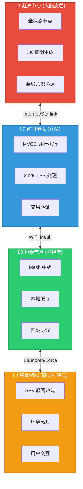
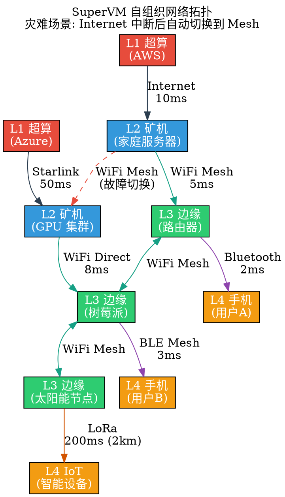
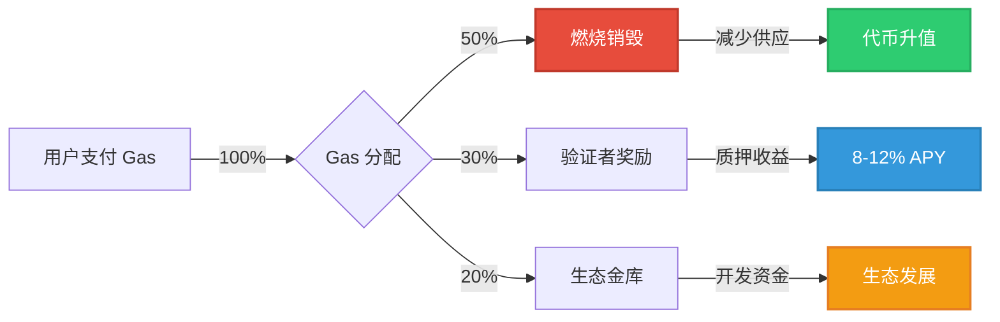
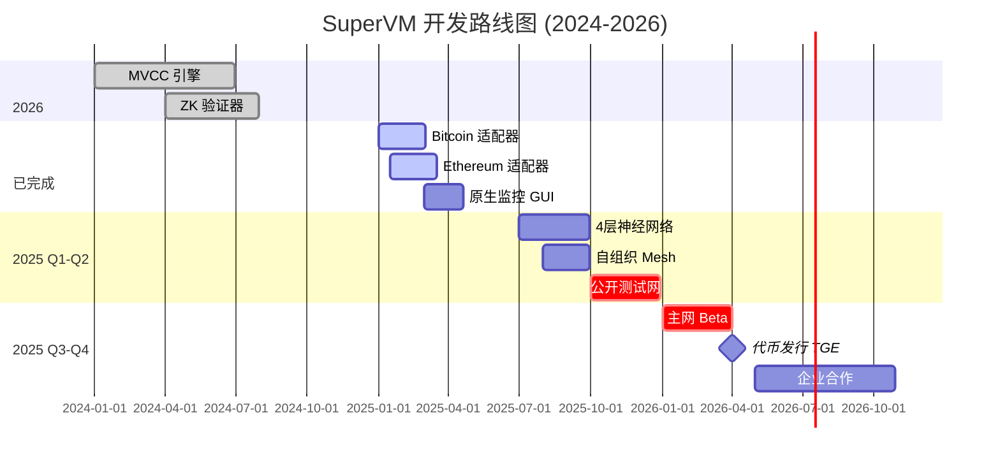

# SuperVM 视觉资产与图表生成指南

> 为白皮书、社交媒体、演示文稿创建专业视觉资产

---

## 🎨 目录

1. [架构图](#架构图)
2. [性能对比图](#性能对比图)
3. [经济模型图](#经济模型图)
4. [路线图时间线](#路线图时间线)
5. [场景示意图](#场景示意图)
6. [工具推荐](#工具推荐)

---

## 🏗️ 架构图

### 1. 四层神经网络架构 (Mermaid)



**导出命令 (使用 mermaid-cli):**

```bash

# 安装

npm install -g @mermaid-js/mermaid-cli

# 生成 PNG

mmdc -i architecture.mmd -o architecture.png -w 2000 -H 1500

# 生成 SVG (可缩放)

mmdc -i architecture.mmd -o architecture.svg

```

---

### 2. 多链融合架构 (ASCII 增强版)

```

┌───────────────────────────────────────────────────────────────┐
│                     SuperVM 核心层 (L0)                        │
│  ┌─────────────┐  ┌─────────────┐  ┌─────────────┐           │
│  │  MVCC 引擎  │  │  WASM 运行时 │  │  ZK 证明器   │           │
│  │  242K TPS   │  │  隔离沙箱   │  │  隐私保护   │           │
│  └─────────────┘  └─────────────┘  └─────────────┘           │
└───────────────────────────────────────────────────────────────┘
                            ▲
                            │ 统一 IR 层
                            ▼
┌───────────────────────────────────────────────────────────────┐
│                  热插拔多链适配器                               │
├───────────┬───────────┬───────────┬───────────────────────────┤
│  Bitcoin  │ Ethereum  │  Solana   │       TRON                │
│  适配器   │  适配器   │  适配器   │       适配器              │
├───────────┼───────────┼───────────┼───────────────────────────┤
│ Bitcoin   │   Geth    │  Solana   │   java-tron               │
│  Core     │  (Go)     │ Validator │     (Java)                │
│  (C++)    │           │  (Rust)   │                           │
├───────────┼───────────┼───────────┼───────────────────────────┤
│ UTXO 模型 │ 账户模型  │ 账户模型  │   账户模型                │
│ 无智能合约│ EVM 兼容  │ Sealevel  │   TVM 兼容                │
└───────────┴───────────┴───────────┴───────────────────────────┘
                            │
                            ▼ 原生资产 (无封装)
                ┌───────────────────────┐
                │  BTC, ETH, SOL, TRX   │
                │   (保留在原链上)       │
                └───────────────────────┘

对比传统跨链桥:
❌ 桥: Lock BTC → Mint wBTC (信任中介,可被盗)
✅ SuperVM: Bitcoin 节点直接集成 → 无需封装

```

---

### 3. 自组织通信网络 (Graphviz DOT)

创建 `network-topology.dot`:



**生成图片:**

```bash
dot -Tpng network-topology.dot -o network-topology.png
dot -Tsvg network-topology.dot -o network-topology.svg

```

---

## 📊 性能对比图

### 4. TPS 性能对比 (Chart.js HTML)

创建 `performance-chart.html`:

```html
<!DOCTYPE html>
<html>
<head>
    <meta charset="UTF-8">
    <title>SuperVM 性能对比</title>
    <script src="https://cdn.jsdelivr.net/npm/chart.js"></script>
    <style>
        body { font-family: Arial, sans-serif; max-width: 800px; margin: 50px auto; }
        canvas { max-height: 500px; }
    </style>
</head>
<body>
    <h1>区块链性能对比 (TPS)</h1>
    <canvas id="tpsChart"></canvas>
    
    <script>
        const ctx = document.getElementById('tpsChart').getContext('2d');
        new Chart(ctx, {
            type: 'bar',
            data: {
                labels: ['Bitcoin', 'Ethereum', 'Cardano', 'Solana', 'Visa', 'SuperVM'],
                datasets: [{
                    label: 'TPS (每秒交易数)',
                    data: [7, 15, 250, 50000, 65000, 242000],
                    backgroundColor: [
                        '#F7931A', // Bitcoin orange
                        '#627EEA', // Ethereum blue
                        '#0033AD', // Cardano blue
                        '#14F195', // Solana green
                        '#1A1F71', // Visa blue
                        '#E74C3C'  // SuperVM red
                    ]
                }]
            },
            options: {
                responsive: true,
                scales: {
                    y: {
                        beginAtZero: true,
                        type: 'logarithmic',
                        title: { display: true, text: 'TPS (对数刻度)' }
                    }
                },
                plugins: {
                    title: {
                        display: true,
                        text: 'SuperVM vs 主流区块链性能对比',
                        font: { size: 18 }
                    },
                    legend: { display: false }
                }
            }
        });
    </script>
    
    <h2>数据来源</h2>
    <ul>
        <li>Bitcoin: 官方文档 (7 TPS)</li>
        <li>Ethereum: Etherscan 数据 (15 TPS)</li>
        <li>Solana: 实测峰值 (50,000 TPS)</li>
        <li>Visa: 官方声明 (65,000 TPS)</li>
        <li>SuperVM: 内部基准测试 (242,000 TPS, 16核 AMD)</li>
    </ul>
</body>
</html>

```

**生成静态图片 (使用 Puppeteer):**

```javascript
// screenshot.js
const puppeteer = require('puppeteer');
(async () => {
    const browser = await puppeteer.launch();
    const page = await browser.newPage();
    await page.goto('file:///path/to/performance-chart.html');
    await page.setViewport({ width: 1200, height: 800 });
    await page.screenshot({ path: 'performance-chart.png' });
    await browser.close();
})();

```

---

### 5. Gas 费用对比 (Markdown 表格 + Python 可视化)

创建 `gas-comparison.py`:

```python
import matplotlib.pyplot as plt
import numpy as np

# 数据

chains = ['Ethereum', 'BSC', 'Polygon', 'Arbitrum', 'Optimism', 'SuperVM']
gas_usd = [15.30, 0.50, 0.05, 0.80, 0.60, 0.01]  # USD per transaction

# 创建柱状图

fig, ax = plt.subplots(figsize=(10, 6))
bars = ax.bar(chains, gas_usd, color=['#627EEA', '#F3BA2F', '#8247E5', '#28A0F0', '#FF0420', '#E74C3C'])

# 添加数值标签

for i, bar in enumerate(bars):
    height = bar.get_height()
    ax.text(bar.get_x() + bar.get_width()/2., height,
            f'${height:.2f}',
            ha='center', va='bottom', fontsize=11, fontweight='bold')

# 样式

ax.set_ylabel('Gas Fee (USD)', fontsize=12)
ax.set_title('Cross-Chain Gas Fee Comparison\nSuperVM: 99.3% cheaper than Ethereum', fontsize=14, fontweight='bold')
ax.set_ylim(0, max(gas_usd) * 1.2)
ax.grid(axis='y', alpha=0.3, linestyle='--')

# 高亮 SuperVM

bars[-1].set_edgecolor('black')
bars[-1].set_linewidth(3)

plt.tight_layout()
plt.savefig('gas-comparison.png', dpi=300, bbox_inches='tight')
print("✅ Gas 对比图已生成: gas-comparison.png")

```

**运行:**

```bash
pip install matplotlib numpy
python gas-comparison.py

```

---

## 💰 经济模型图

### 6. 代币分配饼图 (Python)

创建 `tokenomics.py`:

```python
import matplotlib.pyplot as plt

# 代币分配

labels = ['生态挖矿 40%', '团队 20%\n(4年解锁)', '投资者 15%\n(2年解锁)', '基金会 15%', '公开发售 10%']
sizes = [40, 20, 15, 15, 10]
colors = ['#3498db', '#e74c3c', '#f39c12', '#2ecc71', '#9b59b6']
explode = (0.1, 0, 0, 0, 0)  # 突出生态挖矿

fig, ax = plt.subplots(figsize=(10, 8))
wedges, texts, autotexts = ax.pie(sizes, explode=explode, labels=labels, colors=colors,
                                    autopct='%1.1f%%', startangle=90, textprops={'fontsize': 12})

# 加粗百分比

for autotext in autotexts:
    autotext.set_color('white')
    autotext.set_fontweight('bold')
    autotext.set_fontsize(14)

ax.set_title('$SUPERVM 代币分配\n总供应量: 1,000,000,000', fontsize=16, fontweight='bold', pad=20)

plt.tight_layout()
plt.savefig('tokenomics-distribution.png', dpi=300, bbox_inches='tight')
print("✅ 代币分配图已生成")

```

---

### 7. Gas 燃烧机制流程图 (Mermaid)



---

## 🗓️ 路线图时间线

### 8. 甘特图 (Mermaid)



---

### 9. 交互式时间线 (HTML + Timeline.js)

创建 `roadmap-timeline.html`:

```html
<!DOCTYPE html>
<html>
<head>
    <title>SuperVM Roadmap Timeline</title>
    <link title="timeline-styles" rel="stylesheet" href="https://cdn.knightlab.com/libs/timeline3/latest/css/timeline.css">
    <script src="https://cdn.knightlab.com/libs/timeline3/latest/js/timeline.js"></script>
</head>
<body>
    <div id='timeline' style='width: 100%; height: 600px'></div>
    
    <script>
        var timelineData = {
            "events": [
                {
                    "start_date": {"year": "2024", "month": "1"},
                    "text": {"headline": "MVCC 引擎完成", "text": "242K TPS 性能验证"},
                    "background": {"color": "#3498db"}
                },
                {
                    "start_date": {"year": "2024", "month": "10"},
                    "text": {"headline": "ZK 验证器上线", "text": "RingCT + Groth16 双曲线优化"},
                    "background": {"color": "#2ecc71"}
                },
                {
                    "start_date": {"year": "2025", "month": "3"},
                    "text": {"headline": "多链适配器 MVP", "text": "Bitcoin + Ethereum 原生融合"},
                    "background": {"color": "#f39c12"}
                },
                {
                    "start_date": {"year": "2025", "month": "10"},
                    "text": {"headline": "公开测试网", "text": "邀请社区参与压力测试"},
                    "background": {"color": "#e74c3c"}
                },
                {
                    "start_date": {"year": "2026", "month": "4"},
                    "text": {"headline": "主网上线 + TGE", "text": "$SUPERVM 代币发行"},
                    "background": {"color": "#9b59b6"}
                }
            ]
        };
        
        window.timeline = new TL.Timeline('timeline', timelineData);
    </script>
</body>
</html>

```

---

## 🌍 场景示意图

### 10. 灾难应急场景 (ASCII Art)

```

场景: 地震后 Internet 中断

━━━━━━━━━━━━━━━━━━━━━━━━━━━━━━━━━━━━━━━━━━━━━
时间轴:
━━━━━━━━━━━━━━━━━━━━━━━━━━━━━━━━━━━━━━━━━━━━━

T+0s  地震发生
      ┌─────────────────────────┐
      │ Internet 连接断开 ❌    │
      └─────────────────────────┘

T+3s  SuperVM 自动检测网络异常
      ┌─────────────────────────┐
      │ EmergencyMode 激活      │
      │ 切换到 WiFi Mesh 模式   │
      └─────────────────────────┘

T+30s 本地 Mesh 网络建立
      
      [L3节点A] ←─WiFi─→ [L3节点B]
          │                  │
       Bluetooth          Bluetooth
          │                  │
      [用户手机1]        [用户手机2]
      
      ✅ 本地支付继续运行
      ✅ 交易存入离线队列

T+2h  Internet 部分恢复
      ┌─────────────────────────┐
      │ 自动同步离线交易        │
      │ 72 小时容错窗口          │
      └─────────────────────────┘

T+24h 完全恢复
      ┌─────────────────────────┐
      │ 所有交易确认上链        │
      │ 系统切回常规模式        │
      └─────────────────────────┘

━━━━━━━━━━━━━━━━━━━━━━━━━━━━━━━━━━━━━━━━━━━━━
关键指标:
• 故障检测时间: 3 秒
• Mesh 切换时间: 30 秒
• 离线容错窗口: 72 小时
• 交易零丢失率: 100%
━━━━━━━━━━━━━━━━━━━━━━━━━━━━━━━━━━━━━━━━━━━━━

```

---

### 11. 跨链桥对比信息图 (Figma/Canva 模板)

**文字内容 (可导入设计工具):**

```

━━━━━━━━━━━━━━━━━━━━━━━━━━━━━━━━━━━━━━━━
         传统跨链桥 vs SuperVM
━━━━━━━━━━━━━━━━━━━━━━━━━━━━━━━━━━━━━━━━

┌─────────────────┬─────────────────┐
│  传统跨链桥 ❌   │   SuperVM ✅    │
├─────────────────┼─────────────────┤
│ Lock-Mint 模式  │ 原生节点融合    │
│ 封装资产 (wBTC) │ 原生资产 (BTC)  │
│ $2B+ 被盗       │ 零桥合约风险    │
│ 1-60 分钟延迟   │ 实时状态镜像    │
│ 中心化中继器    │ 去中心化网络    │
│ 流动性碎片化    │ 统一流动性池    │
│ 单点故障        │ 自愈合网络      │
└─────────────────┴─────────────────┘

图标建议:
• 传统桥: 🔒 → 💸 → ❌ (锁定→铸造→被盗)
• SuperVM: 🔌 → ⚡ → ✅ (插入→实时→安全)

```

---

## 🛠️ 工具推荐

### 图表生成工具

| 工具 | 用途 | 优点 | 缺点 |
|------|------|------|------|
| **Mermaid** | 流程图、序列图 | Markdown 原生支持 | 样式定制有限 |
| **Graphviz** | 复杂网络拓扑 | 强大布局算法 | 学习曲线陡峭 |
| **Chart.js** | 数据可视化 | 交互式图表 | 需要 Web 托管 |
| **Matplotlib** | 科学绘图 | Python 生态 | 静态图片 |
| **Figma** | 专业设计 | 协作便利 | 需要设计经验 |
| **Canva** | 快速设计 | 模板丰富 | 免费版水印 |
| **Excalidraw** | 手绘风格 | 简洁美观 | 功能简单 |

---

### 在线工具

**架构图:**

- https://app.diagrams.net (Draw.io) - 免费在线绘图

- https://www.lucidchart.com - 专业流程图工具

- https://excalidraw.com - 手绘风格图表

**数据可视化:**

- https://www.datawrapper.de - 新闻级数据图表

- https://flourish.studio - 动态可视化

- https://www.chartblocks.com - 简单图表生成

**信息图:**

- https://www.canva.com - 设计模板库

- https://piktochart.com - 信息图专用

- https://www.visme.co - 演示文稿 + 信息图

---

### 自动化脚本

创建 `scripts/generate-visuals.ps1`:

```powershell

# SuperVM 视觉资产生成脚本

Write-Host "🎨 开始生成 SuperVM 视觉资产..." -ForegroundColor Cyan

# 创建输出目录

New-Item -ItemType Directory -Force -Path "visuals" | Out-Null

# 生成 Mermaid 图表

Write-Host "📊 生成架构图..." -ForegroundColor Yellow
mmdc -i docs/diagrams/architecture.mmd -o visuals/architecture.png -w 2000
mmdc -i docs/diagrams/gas-mechanism.mmd -o visuals/gas-mechanism.svg

# 生成 Graphviz 图表

Write-Host "🌐 生成网络拓扑图..." -ForegroundColor Yellow
dot -Tpng docs/diagrams/network-topology.dot -o visuals/network-topology.png
dot -Tsvg docs/diagrams/network-topology.dot -o visuals/network-topology.svg

# 运行 Python 脚本

Write-Host "📈 生成性能对比图..." -ForegroundColor Yellow
python scripts/gas-comparison.py
python scripts/tokenomics.py

# 移动生成的文件

Move-Item -Force gas-comparison.png visuals/
Move-Item -Force tokenomics-distribution.png visuals/

Write-Host "✅ 视觉资产生成完成: visuals/" -ForegroundColor Green

```

---

## 📐 设计规范

### 品牌色彩

```

主色:
━━━━━━━━━━━━━━━━━━━━━━━━━━━━━━━━━━
• 潘多拉红:  #E74C3C (品牌主色)
• 深蓝:      #2C3E50 (文字/背景)
• 亮蓝:      #3498DB (链接/按钮)

辅助色:
━━━━━━━━━━━━━━━━━━━━━━━━━━━━━━━━━━
• L1 红:     #E74C3C (大脑)
• L2 蓝:     #3498DB (脊髓)
• L3 绿:     #2ECC71 (神经节)
• L4 橙:     #F39C12 (感觉神经元)

功能色:
━━━━━━━━━━━━━━━━━━━━━━━━━━━━━━━━━━
• 成功:      #2ECC71
• 警告:      #F39C12
• 错误:      #E74C3C
• 信息:      #3498DB

```

### 字体

```

中文:
• 标题: 思源黑体 (Noto Sans CJK SC Bold)
• 正文: 思源宋体 (Noto Serif CJK SC)
• 代码: Fira Code

英文:
• 标题: Montserrat Bold
• 正文: Open Sans
• 代码: Fira Code

```

### 图表尺寸

```

社交媒体:
• Twitter 卡片:  1200x675 px
• LinkedIn 封面: 1584x396 px
• GitHub README: 800x400 px

文档:
• 白皮书配图:    1000x600 px
• Pitch Deck:    1920x1080 px (16:9)
• 博客文章:      800x500 px

```

---

## ✅ 发布检查清单

- [ ] 所有图表包含版权声明 (© 2025 SuperVM Foundation)

- [ ] 导出 PNG (高分辨率 300 DPI) + SVG (可缩放) 两种格式

- [ ] 文件名规范: `supervm-architecture-v1.png`

- [ ] 添加替代文本 (Alt text) 用于可访问性

- [ ] 优化文件大小 (TinyPNG 压缩 PNG)

- [ ] 创建缩略图版本 (400x300 px)

- [ ] 上传到 CDN 或 GitHub repo (`docs/images/`)

- [ ] 更新文档链接 (``)

---

**快速生成所有视觉资产:**

```powershell

# 安装依赖

npm install -g @mermaid-js/mermaid-cli
choco install graphviz
pip install matplotlib

# 运行生成脚本

.\scripts\generate-visuals.ps1

# 检查输出

ls visuals/

```

🎉 生成完成后,`visuals/` 目录将包含:

- ✅ architecture.png/svg (四层架构图)

- ✅ network-topology.png/svg (网络拓扑)

- ✅ gas-comparison.png (Gas 费用对比)

- ✅ tokenomics-distribution.png (代币分配)

- ✅ performance-chart.png (TPS 性能)

- ✅ gas-mechanism.svg (燃烧机制流程)
